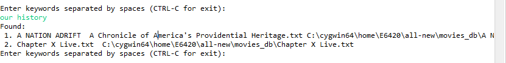
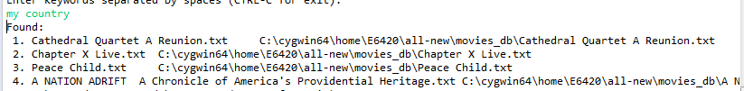

# TF-IDF based recommendation for Movies, Music albums based on Amazon Reviews

<h4>Group-member</h4>
Sagar Sharma

<h4>Project Overview </h4>
The project tries to recommend movies tiles and music albums based on the TF-IDF score of the keywords supplied by the user.
The final TF-IDF score is the addition of individual TF-IDF scores of each keyword.

<h5>Tasks involvedand approach</h5>
 1)transforming the Amazon reviews dataset in to appropriate format. The reviews file is a big json file consisting of item-id known as asin(in the terminologies of amazon) . This json has to be parsed and the reviews must be grouped by asin. Using the metadata.json file this asin is mapped on to the title and a saperate file is created corresponding to every title. Each file contains reviews corresponding to that title.
 2)the data set is loaded in the form of dataframe
 3)each document is assigned an id
 4)the document is unfolded into tokens in order to calculate Term Frequency
 5)tokens are extracted out and term frequecies are calculated using calculated using group by and aggregated count function
 6)similarly document frequencies are calculated using group by and aggregated count distinct function
 7)idf score is calculated according to the formula :

 8)the TF-IDF score is calculated for each token by multiplying the TF with IDF
 9)user is asked for input
 10)the matching documents are extracted which contains the keywords and grouped by the title
 11)the TF-IDF of every keyword is added and the documents are order in the decresing order of TF-IDF scores

<h5>Final Product</h5>
 The final product is the Movie-recommendation system that gives results on the basis of Amazon reviews

<h5>Context and Motivation</h5>
 A lot of people have specific taste of movies and albums. They know what they are looking for. This system will help them get the movies they are looking for. It's similar to asking a friend for a suggestion of a movie by describing the type of movie someone is interested in.

<h5>Dataset</h5>
 https://nijianmo.github.io/amazon/index.html
 This dataset contains reviews of various amazon products ae well as thier meta-data

<h5>Frameworks used</h5>
 Spark-Core 
 Spark-SQL

<h5>Anyother software and packages used </h5>
 Scala programming language
 SBT: a build tool on the top of maven
 Eclipse for Scala IDE

<h5>Illustrative Results and Examples</h5>
 

<h5>Performance Evalutaion</h5>
 
 Qualitatively, The Movies obtained were related to keyword supplied (if we google the movie, and read it's plot and description)
 Please refer the plot for the movie Chapter X live at 
 https://www.sparknotes.com/lit/narrative/section7/
 The movie is quite resonant with words such as "country" and "trust"

<h5>Tasks Accomplished</h5>
 Will be definated done: TF-IDF implemetation
 Likely to do: None  
 ideally to do: None  

<h5>Additional Observations</h5>
 COLLECT_SET is highly performace intensive
  SBT is an excellent tool. If you want to change the version of your scala compiler, simply change the version number. All the dependecies will be automatically resolved and code will be compiled by new version

<h5>Division of Work</h5>
 Sagar Sharma

<h5>Important Reference </h5>
 https://dzone.com/articles/calculating-tf-idf-with-apache-spark
 https://www.youtube.com/watch?v=qrPjAyIapFY

