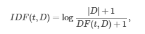

# TF-IDF based Movie and Music search based on Amazon Reviews

This project aims to retrieve Movies as well as Music based on the TF-IDF weights of the terms in the documents and keyword supplied by the User 

## Context and Motivation
A lot of people have specific taste of movies and albums. They know what they are looking for. This system will help them get the movies they are looking for. It's similar to asking a friend for a suggestion of a movie by describing the type of movie someone is interested in.

## Dataset

The Dataset is a corpus of 8,765,568 reviews of 203,970 products. These products are mainly Movies and Music Albums.
The dataset can be found at:
https://nijianmo.github.io/amazon/index.html


## Data-preprocessing
The data is a single document consisting of the following review of a movie in the following JSON format
```
{
  "overall": 5,
  "verified": true,
  "reviewTime": "08 6, 2016",
  "reviewerID": "A3HE4QW1655VB9",
  "asin": "0005419263",
  "style": {
    "Format:": " Audio CD"
  },
  "reviewerName": "bethany robinson",
  "reviewText": "ideal for kids",
  "summary": "Loved it!",
  "unixReviewTime": 1470441600
}

```
The movies and music albums are identified by an unique id ```asin```

There is another document corpus consisting of metadata about the movies and music albums.


```
{
  "category": [
    "Movies & TV",
    "Movies"
  ],
  "title": "Chapter X Live [VHS]",
  "rank": "1,007,436inMoviesTV(",
  "also_view": [
    "B005IGVTDS",
    "B00LVCK6VO",
    "B000002HQW",
    "B0006L0LM0",
    "B00092ZLXA",
    "B00SINZ0NS",
    "B000005IRR",
    "B000005IRU"
  ],
  "main_cat": "Movies & TV",
  "asin": "000503860X"
}

```
This document corpus of reviews of Movies and Music albums is broken down into individual documents whose name of the file is the name of the Movie or Music Album and content of the document are the reviews corresponding to the Movie or Music Albums. So after preprocessing of data, we have 203,970 number of documents.

A small portion of the data preprocessing part is implemented under the project folder SimpleApps.7z 


## TF-IDF calculation

The formula for TF-IDF is as follows:




The project folder all-new implements the process of calculating TF-IDF as well as searches the document based on TF-IDF weights.


1)the documents are taken into the data frame and are assigned document ID
2)All the punctuation, stop-words and a few common words as as love, climax, happy, ending is removed
3)the original dataframe is transformed to get a new dataframe with 
  document_ID and term as the columns of the dataframe
4)the term frequency, document frequency and inverse document frequencies are calculated using aggregate functions
5)terms and their respective TF-IDF score are stored in cache

 
## Document Searcher
1)the user supplied keywords are taken into a set
2)set of matching documents are retrieved which contains the user supplied keywords
3) The total TF-IDF score is calculated with the help of the formula
```
TF-IDF(Document) = TF-IDF(Keyword1) + TF-IDF(Keyword2) +TF-IDF(Keyword3) +TF-IDF(Keywordn)
```

5)The top 5 documents with the decreasing score of TF-IDF is shown along with the file-path(treat file path as URL of the resource)


## Final Product
The final product is a TF-IDF based search engine of Movies and Music Albums


## Frameworks used

1) Spark-Core

2) Spark-SQL

## Software Package
1) Scala programming language
2) SBT: a build tool on the top of maven
3) Eclipse for Scala IDE

## Steps to run on DSBA cluster
1) An Assembly jar file is provided to you 
"movie-recommendation-all-new-assembly-0.1-SNAPSHOT"
2) copy the jar on DSBA cluster
3) copy the movies_db folder to the DSBA cluster (the folder contains 4 sample movies and music albums)
4) Run the following command
```
spark-submit movie-recommendation-all-new-assembly-0.1-SNAPSHOT movies_db

```


## Illustrative Examples

1)


2)


3)


4)


5)


## Performance Evaluation
Take example 2 
User Specified Keyword is : ```Trust```

The Result was: ```Chapter-X-live ```

The dataset in movies_db contains only the following line with the word ```Trust```

``` Trust me when I say this: they never disappoint as a live band!```

There is no other review that contains the word ``` trust```.
So it is safe to say that Movie and Music Search Engine is performing upto the mark.

## Additional Notes

### Document preprocessor

Here is my attempt to process the document using the the method of Hive-Context: collect_set() and pandas UDF in pyspark

```python
def collect_array_grouped(df, groupbyCols, aggregateCol, outputCol):
    
    groupbyCols = [] if groupbyCols is None else groupbyCols
    df = df.select(groupbyCols + [aggregateCol])
    schema = df.select(groupbyCols).schema
    aggSchema = df.select(aggregateCol).schema
    arrayField = StructField(name=outputCol, dataType=ArrayType(aggSchema[0].dataType, False))
    schema = schema.add(arrayField)
    @pandas_udf(schema, PandasUDFType.GROUPED_MAP)
    def _get_array(pd_df):
        vals = pd_df[groupbyCols].iloc[0].tolist()
        vals.append(pd_df[aggregateCol].values)
        vals.append(",")
        return pd.DataFrame([vals])
    return df.groupby(groupbyCols).apply(_get_array)


 ```


The above code creates documents aggregating  reviews of each of the unique movie/ music album in my document corpus.

The way to call this function
``` python

df = spark.createDataFrame(rdd)

df2 = collect_array_grouped(df, ['title'], 'review_text', 'review_text_all')

``` 
### this above method is highly compute intensive.

We will get the dataframe in the form:


title | review_text_all 
--- | --- 
 Movie-1| great movie, lovely movie| 
 Music-1| peppy song, Can listen for-ever| 

In the end every row will be written in a separate file to get the documents containing the reviews.

## Artifacts
Artifact | Description 
--- | --- 
SimpleApp| the project(an attempt) to preprocess data: Was highly compute intensive
documentPreprocessor.py|code to preprocess the data in pyspark (please read the report for functionality): Was highly compute intensive
All-new| project of the search engine
movie-recommendation-all-new-assembly-0.1-SNAPSHOT.jar|jar to run in cluster

## References
https://dzone.com/articles/calculating-tf-idf-with-apache-spark

https://www.youtube.com/watch?v=qrPjAyIapFY
